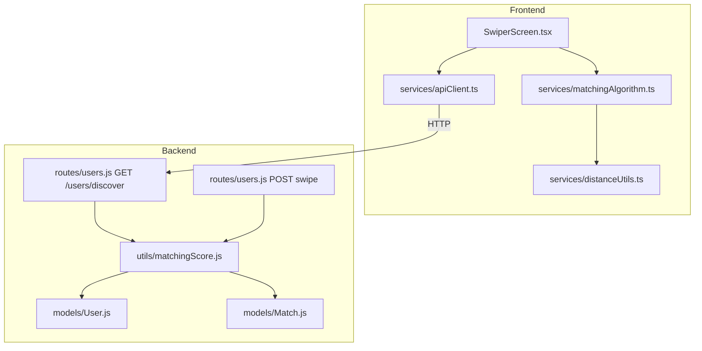
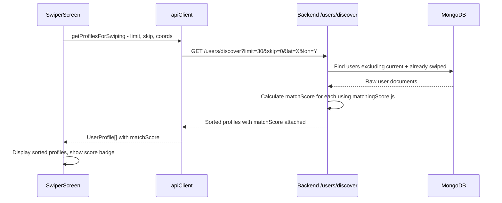
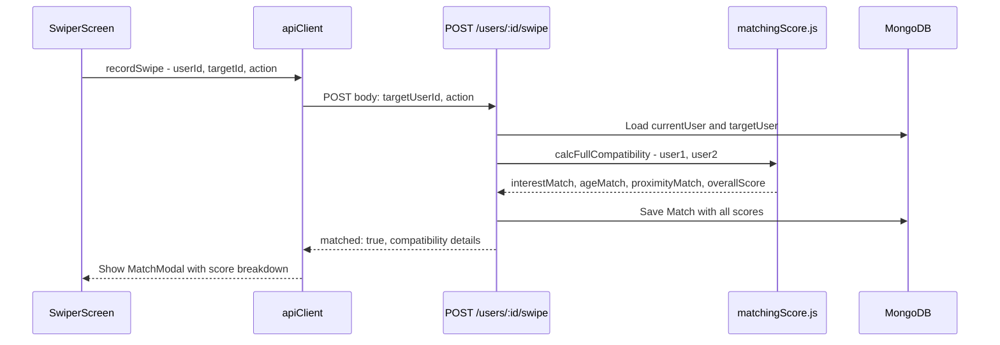
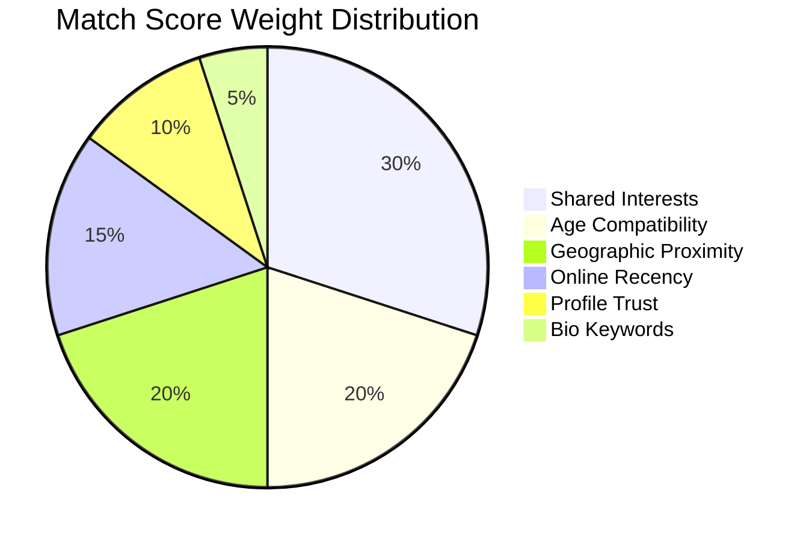

# Enhanced Matching Algorithm — Architecture Plan

## 1. Problem Statement

The current [`calcMatchScore()`](components/SwiperScreen.tsx:33) function in `SwiperScreen.tsx` uses only three signals:

| Factor | Max Points | Weight |
|--------|-----------|--------|
| Location string equality | 20 | 20% |
| Geographic distance | 30 | 30% |
| Shared interests count | 50 | 50% |

**Issues:**
- Location string match double-counts proximity alongside geodistance
- No age compatibility consideration
- No online recency signal — inactive ghost profiles rank alongside active users
- No profile quality/verification trust signal
- No lifestyle or values-based compatibility
- Scoring only happens on the client; the backend has its **own** `calculateCompatibility()` inside [`backend/routes/users.js:221`](backend/routes/users.js:221) that is separate and inconsistent

---

## 2. Proposed Algorithm: Multi-Factor Compatibility Score

A unified scoring engine used by both **frontend** (profile ordering) and **backend** (match quality recording).

### 2.1 Scoring Factors (100-point scale)

```
┌────────────────────────────────────────────────────────┐
│  COMPATIBILITY SCORE BREAKDOWN (max 100)               │
├──────────────────────┬────────┬─────────────────────────┤
│ Factor               │ Weight │ Data Source              │
├──────────────────────┼────────┼─────────────────────────┤
│ Shared Interests     │ 30 pts │ interests[]              │
│ Age Compatibility    │ 20 pts │ age                      │
│ Geographic Proximity │ 20 pts │ coordinates              │
│ Online Recency       │ 15 pts │ isOnline, lastSeen       │
│ Profile Trust        │ 10 pts │ verification, photos,bio │
│ Bio Similarity Bonus │  5 pts │ bio keyword overlap      │
└──────────────────────┴────────┴─────────────────────────┘
```

### 2.2 Detailed Scoring Rules

#### Factor 1: Shared Interests (0–30 pts)

Uses Jaccard similarity coefficient for fair comparison regardless of list length.

```ts
const userInterests = new Set(currentUser.interests);
const profileInterests = new Set(profile.interests);
const intersection = [...profileInterests].filter(i => userInterests.has(i)).length;
const union = new Set([...userInterests, ...profileInterests]).size;
const jaccard = union > 0 ? intersection / union : 0;
score += Math.round(jaccard * 30);
```

| Overlap | Score |
|---------|-------|
| 100% Jaccard | 30 |
| 50% Jaccard | 15 |
| 0% Jaccard | 0 |

#### Factor 2: Age Compatibility (0–20 pts)

Linear decay from max score at zero age difference down to zero at 20+ years gap.

```ts
const ageDiff = Math.abs(profile.age - currentUser.age);
const ageScore = Math.max(0, 20 - ageDiff);
score += ageScore;
```

| Age Gap | Score |
|---------|-------|
| 0 years | 20 |
| 5 years | 15 |
| 10 years | 10 |
| 20+ years | 0 |

#### Factor 3: Geographic Proximity (0–20 pts)

Logarithmic decay — close users score high, but distant users still get some credit.

```ts
if (currentUser.coordinates && profile.coordinates) {
  const distKm = calculateDistance(currentUser.coordinates, profile.coordinates);
  if      (distKm <=    5) score += 20;
  else if (distKm <=   25) score += 15;
  else if (distKm <=  100) score += 10;
  else if (distKm <=  500) score +=  5;
  else if (distKm <= 1000) score +=  2;
  // 1000+ km = 0 pts
}
```

#### Factor 4: Online Recency (0–15 pts)

Prioritize active users to reduce "ghost profile" fatigue.

```ts
if (profile.isOnline) {
  score += 15;
} else if (profile.lastSeen) {
  const elapsed = Date.now() - profile.lastSeen;
  if      (elapsed < 3_600_000)   score += 12;  // < 1 hour
  else if (elapsed < 86_400_000)  score +=  8;  // < 24 hours
  else if (elapsed < 604_800_000) score +=  3;  // < 7 days
  // 7+ days = 0 pts
}
```

#### Factor 5: Profile Trust & Quality (0–10 pts)

Reward complete, verified profiles to build platform trust.

```ts
if (profile.isPhotoVerified)                                     score += 3;
if (profile.verification?.status === 'VERIFIED')                 score += 3;
if (profile.images && profile.images.length >= 3)                score += 2;
if (profile.bio && profile.bio.length >= 30)                     score += 1;
if (profile.emailVerified)                                       score += 1;
```

#### Factor 6: Bio Keyword Similarity Bonus (0–5 pts)

Extract meaningful keywords from bios and reward overlap.

```ts
const extractKeywords = (bio: string): Set<string> => {
  const stopwords = new Set(['i', 'a', 'the', 'and', 'or', 'to', 'in', 'for', 'of', 'is', 'am', 'my', 'me']);
  return new Set(
    bio.toLowerCase()
      .replace(/[^a-z0-9\s]/g, '')
      .split(/\s+/)
      .filter(w => w.length > 2 && !stopwords.has(w))
  );
};

if (profile.bio && currentUser.bio) {
  const kw1 = extractKeywords(currentUser.bio);
  const kw2 = extractKeywords(profile.bio);
  const commonKw = [...kw2].filter(w => kw1.has(w)).length;
  score += Math.min(commonKw, 5);
}
```

---

## 3. Architecture

### 3.1 Component Diagram



### 3.2 Data Flow for Swipe Screen



### 3.3 Scoring Flow on Match Creation



---

## 4. Files to Create / Modify

### 4.1 NEW: `services/matchingAlgorithm.ts` (Frontend Scoring Service)

A pure-function module exporting:

- `calcMatchScore(profile, currentUser): number` — the main 0–100 composite score
- `calcInterestScore(profile, currentUser): number` — Jaccard-based interest similarity
- `calcAgeScore(profile, currentUser): number`
- `calcProximityScore(profile, currentUser): number`
- `calcRecencyScore(profile): number`
- `calcTrustScore(profile): number`
- `calcBioScore(profile, currentUser): number`
- `getScoreBreakdown(profile, currentUser): ScoreBreakdown` — returns all sub-scores for UI display

This replaces the inline [`calcMatchScore`](components/SwiperScreen.tsx:33) function.

### 4.2 NEW: `backend/utils/matchingScore.js` (Backend Scoring Utility)

Mirror of the frontend algorithm in plain JS for server-side use:

- `calcMatchScore(user1Doc, user2Doc): number`
- `calcCompatibility(user1Doc, user2Doc): CompatibilityResult`

Used by:
- [`backend/routes/users.js`](backend/routes/users.js:221) — replaces inline `calculateCompatibility`
- New discovery endpoint for server-side pre-sorting

### 4.3 MODIFY: `components/SwiperScreen.tsx`

- Remove inline [`calcMatchScore`](components/SwiperScreen.tsx:33) (lines 33-50)
- Import from `services/matchingAlgorithm.ts`
- Update [`getMatchScore`](components/SwiperScreen.tsx:381) callback to use new service
- Add score breakdown display to the profile card UI (small compatibility badge)

### 4.4 MODIFY: `backend/routes/users.js`

- Import `matchingScore.js` utility
- Replace inline [`calculateCompatibility`](backend/routes/users.js:221) (lines 221-237) with shared utility
- Add new `GET /users/discover` endpoint with server-side scoring and pre-sorting
- Existing `GET /users` remains as-is for backwards compatibility

### 4.5 MODIFY: `backend/models/Match.js`

- Add `overallScore: { type: Number, default: 0 }` — composite 0-100 score
- Add `proximityMatch: { type: Number, default: 0 }` — km distance
- Add `recencyScore: { type: Number, default: 0 }` — activity freshness
- Add `trustScore: { type: Number, default: 0 }` — profile quality

### 4.6 MODIFY: `backend/models/User.js`

Add optional lifestyle fields for future enhanced matching:

```js
// Lifestyle preferences - optional, for enhanced matching
lifestyle: {
  relationshipGoal: { type: String, enum: ['casual', 'serious', 'friendship', 'networking'] },
  smoking: { type: String, enum: ['never', 'sometimes', 'regularly'] },
  drinking: { type: String, enum: ['never', 'socially', 'regularly'] },
  exercise: { type: String, enum: ['never', 'sometimes', 'regularly', 'daily'] },
  pets: { type: String, enum: ['none', 'cats', 'dogs', 'both', 'other'] },
  children: { type: String, enum: ['none', 'want', 'have', 'dont_want'] },
  religion: { type: String },
  education: { type: String, enum: ['high_school', 'college', 'bachelors', 'masters', 'phd', 'other'] },
  languages: [{ type: String }],
}
```

> **Note:** These fields are optional and will be used as bonus scoring when both users have filled them in. The core algorithm works without them.

### 4.7 MODIFY: `types.ts`

Add corresponding TypeScript interface:

```ts
export interface LifestylePreferences {
  relationshipGoal?: 'casual' | 'serious' | 'friendship' | 'networking';
  smoking?: 'never' | 'sometimes' | 'regularly';
  drinking?: 'never' | 'socially' | 'regularly';
  exercise?: 'never' | 'sometimes' | 'regularly' | 'daily';
  pets?: 'none' | 'cats' | 'dogs' | 'both' | 'other';
  children?: 'none' | 'want' | 'have' | 'dont_want';
  religion?: string;
  education?: 'high_school' | 'college' | 'bachelors' | 'masters' | 'phd' | 'other';
  languages?: string[];
}

// Add to UserProfile interface:
lifestyle?: LifestylePreferences;
```

### 4.8 MODIFY: `services/apiClient.ts`

Update `getProfilesForSwiping` to use the new `/users/discover` endpoint.

---

## 5. Algorithm Comparison

### Before (Current)

```
Score = location_match(20) + geo_distance(30) + interests(50) = max 100
```

- Proximity dominates (50% effective weight with double-counting)
- No age, recency, quality, or lifestyle signals
- Frontend-only scoring; backend uses separate inconsistent logic

### After (Proposed)

```
Score = interests(30) + age(20) + proximity(20) + recency(15) + trust(10) + bio(5) = max 100
```

- Interests are the strongest signal (30%) — shared passions matter most
- Age compatibility is second (20%) — fundamental dating factor
- Proximity is third (20%) — still important but not dominant
- Recency (15%) rewards active users
- Trust (10%) rewards verified, complete profiles
- Bio similarity (5%) catches lifestyle keyword overlap
- Future: Lifestyle preferences can absorb 10-15 pts from other buckets when filled

### Weight Visualization



---

## 6. Future Enhancement: Lifestyle Preferences Scoring

When both users have filled in lifestyle preferences, a **bonus layer** can be added (redistributing from existing weights or adding a 7th factor). Example:

```ts
const calcLifestyleScore = (p1: LifestylePreferences, p2: LifestylePreferences): number => {
  let matches = 0;
  let total = 0;

  const fields = ['relationshipGoal', 'smoking', 'drinking', 'exercise', 'children'] as const;
  for (const f of fields) {
    if (p1[f] && p2[f]) {
      total++;
      if (p1[f] === p2[f]) matches++;
    }
  }

  // Language overlap
  if (p1.languages?.length && p2.languages?.length) {
    const common = p1.languages.filter(l => p2.languages?.includes(l)).length;
    if (common > 0) { matches++; total++; }
  }

  return total > 0 ? Math.round((matches / total) * 15) : 0; // 0-15 pts
};
```

This is Phase 2 and requires UI for collecting these preferences.

---

## 7. Implementation Order

| Step | File | Action |
|------|------|--------|
| 1 | `services/matchingAlgorithm.ts` | **CREATE** — pure scoring functions |
| 2 | `backend/utils/matchingScore.js` | **CREATE** — backend scoring mirror |
| 3 | `types.ts` | **MODIFY** — add LifestylePreferences, ScoreBreakdown |
| 4 | `backend/models/User.js` | **MODIFY** — add lifestyle schema fields |
| 5 | `backend/models/Match.js` | **MODIFY** — add overallScore, proximityMatch, etc. |
| 6 | `components/SwiperScreen.tsx` | **MODIFY** — replace calcMatchScore with import |
| 7 | `backend/routes/users.js` | **MODIFY** — add /discover endpoint, use shared scoring in swipe |
| 8 | `services/apiClient.ts` | **MODIFY** — update getProfilesForSwiping |
| 9 | `components/SwiperScreen.tsx` | **MODIFY** — add score badge to card UI |
| 10 | Test scripts | **CREATE** — validation tests |

---

## 8. Risks & Mitigations

| Risk | Mitigation |
|------|-----------|
| Backend scoring on large user sets is slow | Use MongoDB `$geoNear` for initial filtering, then score top N only |
| lastSeen/isOnline may not be reliably updated | Recency score degrades gracefully — zero points if missing |
| Lifestyle fields are empty for existing users | Algorithm works fully without them; they are bonus only |
| Frontend and backend algorithms diverge | Share scoring constants or use backend-only scoring via /discover |
| Bio keyword extraction is language-dependent | Start with English stopwords; extend later |
